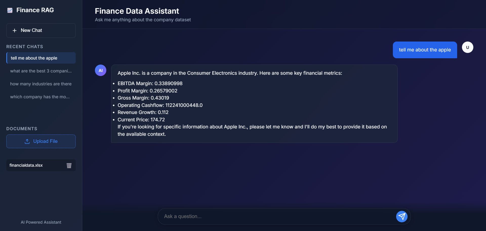

## Project UI



Enterprise RAG Assistant

### Transform Corporate Knowledge into Instant Intelligence

> An enterprise-grade AI assistant powered by Retrieval-Augmented Generation (RAG) that enables organizations to securely search, understand, and interact with internal knowledge using natural language.

 Overview

The **Enterprise RAG Assistant** bridges the gap between organizational knowledge and decision-making by transforming static documents into an intelligent conversational experience.

Built with **Groq's ultra-fast LLM inference**, **Qdrant vector search**, and **LangChain orchestration**, the system retrieves relevant information from company datasets and generates precise, context-aware responses grounded in your proprietary knowledge base.

Instead of manually searching through reports, spreadsheets, and documentation, users can simply ask questions and receive reliable answers within seconds.

---

 Core Capabilities

### Intelligent Knowledge Retrieval

Leverages semantic search and vector embeddings to understand user intent and retrieve the most relevant information from enterprise documents.

###  Real-Time AI Responses

Powered by Groq's high-performance inference engine, delivering near-instant answers with minimal latency.

### Context-Grounded Generation

Reduces hallucinations by generating responses exclusively from retrieved organizational knowledge.

###  Advanced Semantic Search

Understands meaning rather than keywords, enabling accurate information discovery across large datasets.

###  Enterprise-Ready Security

Ensures sensitive business information remains protected while maintaining controlled access to organizational knowledge.

###  Scalable Architecture

Designed to support growing document repositories and future integration with databases, cloud storage, and business applications.

---

## Technology Stack

| Component              | Technology                               |
| ---------------------- | ---------------------------------------- |
| Programming Language   | Python                                   |
| LLM Provider           | Groq                                     |
| AI Framework           | LangChain                                |
| Embedding Model        | Hugging Face Embeddings                  |
| Vector Database        | Qdrant                                   |
| Data Source            | Enterprise Documents / CSV / Excel / PDF |
| Environment Management | Python Virtual Environment               |

---

## System Architecture

```text
User Query
     │
     ▼
Embedding Model
     │
     ▼
Qdrant Vector Database
     │
Retrieve Relevant Context
     │
     ▼
Groq LLM
     │
     ▼
Context-Aware Response
```

---

## Quick Start

### 1. Clone the Repository

```bash
git clone https://github.com/YOUR_USERNAME/enterprise-rag-assistant.git
cd enterprise-rag-assistant
```

### 2. Create Virtual Environment

```bash
python -m venv venv

# Windows
venv\Scripts\activate

# Linux / Mac
source venv/bin/activate
```

### 3. Install Dependencies

```bash
pip install -r requirements.txt
```

### 4. Configure Environment Variables

Create a `.env` file in the project root:

```env
# Groq API Key for LLM Inference
GROQ_API_KEY=<YOUR_GROQ_API_KEY>
```

### 5. Launch the Application

```bash
python app.py
```

---

## 📈 Future Enhancements

* Multi-document ingestion pipeline
* PDF, Excel, CSV, and database connectors
* Conversational memory
* Hybrid Search (Vector + Keyword)
* Agentic RAG workflows
* Web-based user interface
* Role-based access control (RBAC)
* Cloud deployment with Docker and Kubernetes

---

##  Learning Outcomes

This project demonstrates practical expertise in:

* Retrieval-Augmented Generation (RAG)
* Vector Databases
* Embedding Models
* Large Language Models (LLMs)
* Semantic Search
* LangChain Development
* AI System Architecture
* Enterprise AI Applications

---

## Contributing

Contributions, feature requests, and feedback are welcome. Feel free to open an issue or submit a pull request.

---

## ⭐ Support

If you find this project useful, consider giving it a star. Your support helps improve and expand the project further.
